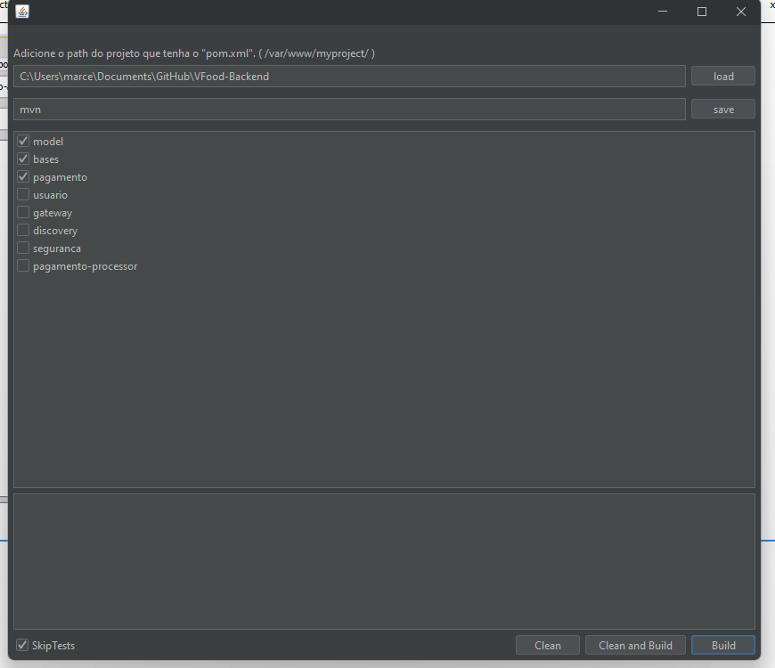
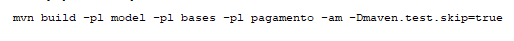

## Maven GUI Builder

- Programinha para fazer builds e cleans automatizados de projetos multi-modules Maven, sem a necessidade de ficar digitando comandos toda hora. O projeto é simples e funciona assim:
  1. Adicione a pasta raiz do seu projeto Maven que tenha o arquivo "pom.xml" dentro da mesma.
  2. Adicione o caminho absoluto ou o alias do mavem cli "mvn ou mvnw".
  3. Ao clicar no botão "load" será carregado a lista de módulos dentro do seu projeto.
    
    
    
  4. Marque quais módulos deseja construir, e utilize as 3 opções (Clean, Clean and Build, Build).

### A fazer
- [ ] Aplicar o comando construido ao cmd ou shell
- [ ] Melhorias e correções de possiveis erros
- [ ] Testes Unitários
- [ ] Aplicar o `launch4j` ao projeto e utilizar o `Inno Setup`